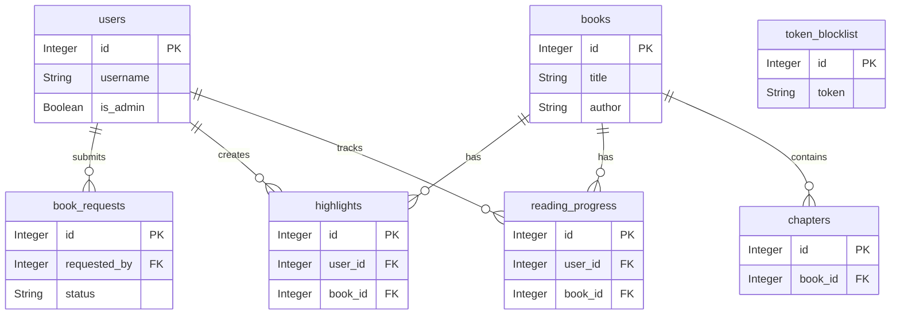

# 🗄️ Database Architecture

> While the BookWormHole backend server is a private implementation, this document outlines its relational database schema. This provides context on how the Android application's data is structured, linked, and stored remotely.

---

## 🗺️ Entity-Relationship Diagram

---

## 📊 Table Definitions

*Click on any table name to expand its schema details.*

<b>👤 users</b> (Registered accounts and authentication)

 

| Column | Type | Constraints | Description |
| :--- | :--- | :--- | :--- |
| `id` | Integer | Primary Key, Indexed | Unique user identifier. |
| `username` | String | Unique, Indexed | The user's login name. |
| `password_hash` | String | | Bcrypt hashed password. |
| `is_admin` | Boolean | Default: `false` | Grants access to the Admin Dashboard. |
| `created_at` | DateTime | | Timestamp of account creation. |
| `last_login` | DateTime | | Timestamp of the most recent login. |

<b>📚 books</b> (Ingested e-book metadata and covers)

 

| Column | Type | Constraints | Description |
| :--- | :--- | :--- | :--- |
| `id` | Integer | Primary Key, Indexed | Unique book identifier. |
| `title` | String | Indexed | The title of the e-book. |
| `author` | String | | The author of the e-book. |
| `total_chapters`| Integer | | Total number of parsed chapters. |
| `series_name` | String | Nullable | Name of the series (if applicable). |
| `series_number` | Float | Nullable | Order in the series (e.g., 1.0, 1.5). |
| `cover_image` | Text | Nullable | Base64 encoded JPEG cover art. |
| `summary` | String | Nullable | A brief description of the book. |
| `date_added` | DateTime | | Timestamp of when the book was uploaded. |

<b>📄 chapters</b> (Extracted raw text payload)

 

| Column | Type | Constraints | Description |
| :--- | :--- | :--- | :--- |
| `id` | Integer | Primary Key, Indexed | Unique chapter identifier. |
| `book_id` | Integer | Foreign Key (`books.id`) | Links chapter to its parent book. |
| `chapter_index` | Integer | Indexed | The sequential order of the chapter (0-based). |
| `chapter_title` | String | Default: `"Unknown"`| Parsed title of the chapter. |
| `content` | Text | | The complete HTML/Text content of the chapter. |

<b>🔖 reading_progress</b> (Saved reader locations)

 

| Column | Type | Constraints | Description |
| :--- | :--- | :--- | :--- |
| `id` | Integer | Primary Key, Indexed | Unique tracking identifier. |
| `user_id` | Integer | Foreign Key (`users.id`) | The user reading the book. |
| `book_id` | Integer | Foreign Key (`books.id`) | The book being read. |
| `current_chapter`| Integer | Default: `0` | The chapter index the user was last on. |
| `scroll_progress`| Float | Default: `0.0` | The exact vertical scroll percentage. |
| `last_accessed` | DateTime | Auto-updates | Used to determine the "Continue Reading" widget. |
| `is_completed` | Boolean | Default: `false` | Marks if the user reached the end. |

<b>📥 book_requests</b> (User submitted library tickets)

 

| Column | Type | Constraints | Description |
| :--- | :--- | :--- | :--- |
| `id` | Integer | Primary Key, Indexed | Unique request ticket identifier. |
| `open_library_id`| String | Indexed | ID from the Open Library API (if automated). |
| `title` | String | Not Null | Requested book title. |
| `author` | String | Default: `"Unknown"`| Requested book author. |
| `cover_url` | String | Nullable | Remote URL for the book cover. |
| `requested_by` | Integer | Foreign Key (`users.id`) | The user who submitted the request. |
| `status` | String | Default: `"pending"`| Current state (`pending`, `approved`, `rejected`). |
| `requested_at` | DateTime | | Timestamp of submission. |

<b>🖍️ highlights</b> (User annotations and markers)

 

| Column | Type | Constraints | Description |
| :--- | :--- | :--- | :--- |
| `id` | Integer | Primary Key, Indexed | Unique highlight identifier. |
| `user_id` | Integer | Foreign Key (`users.id`) | The user who made the highlight. |
| `book_id` | Integer | Foreign Key (`books.id`) | The book containing the highlight. |
| `chapter_index` | Integer | | The chapter where the highlight exists. |
| `highlighted_text`| Text | | The exact string of text highlighted. |
| `note` | Text | Nullable | User-added annotation/thoughts. |
| `color` | String | Default: `rgba(...)`| The UI color of the highlight marker. |
| `scroll_percentage`| Float | Default: `0.0` | Scroll location for quick navigation. |
| `created_at` | DateTime | | Timestamp of creation. |

<b>🛡️ token_blocklist</b> (Security and session management)

 

| Column | Type | Constraints | Description |
| :--- | :--- | :--- | :--- |
| `id` | Integer | Primary Key, Indexed | Unique blocklist entry identifier. |
| `token` | String | Unique, Indexed | The revoked JWT string. |
| `revoked_at` | DateTime | | Timestamp of the user logout event. |

---

## 🔗 Cascade & Deletion Rules
To maintain database integrity, the following cascade rules are strictly enforced at the ORM layer:

* **Deleting a User** triggers a cascading delete, removing all associated `reading_progress`, `highlights`, and `book_requests`.
* **Deleting a Book** triggers a cascading delete, wiping all associated `chapters`, `reading_progress`, and `highlights` globally.