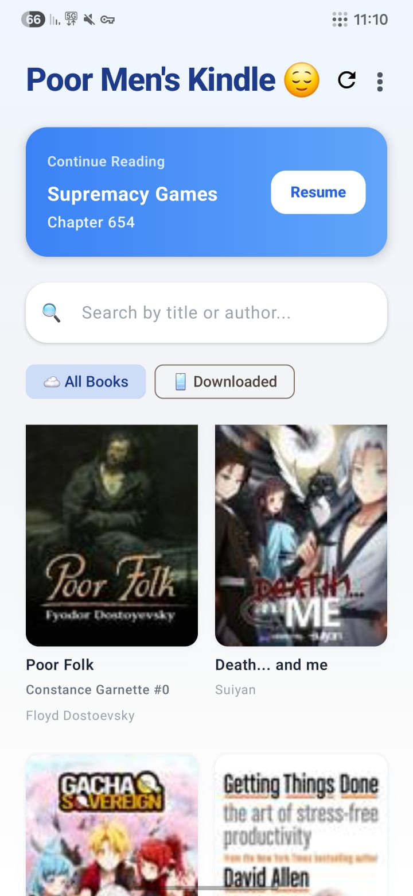
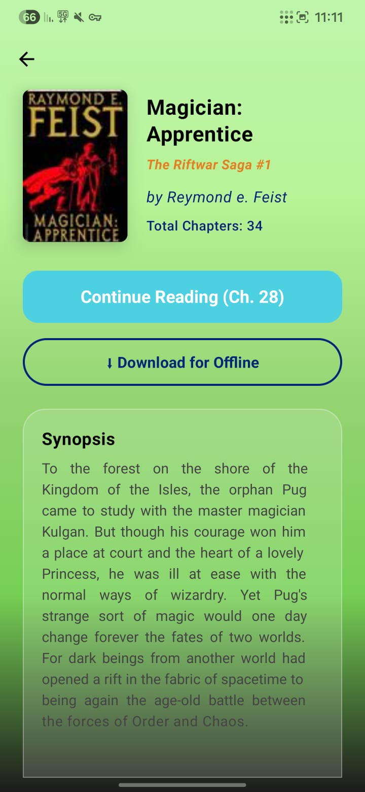
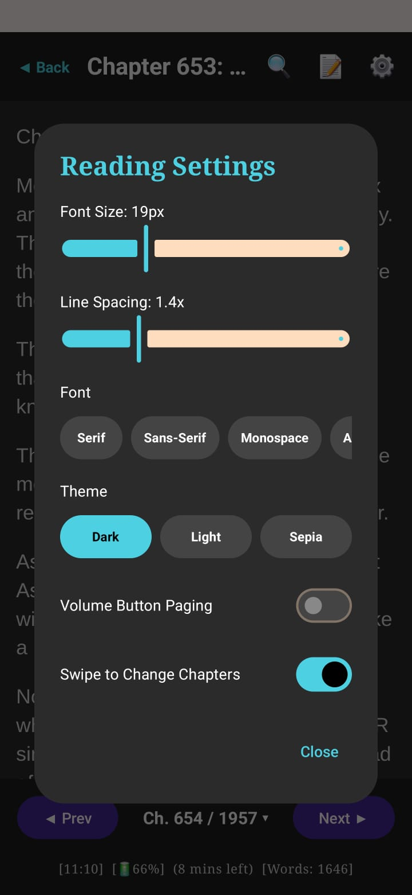
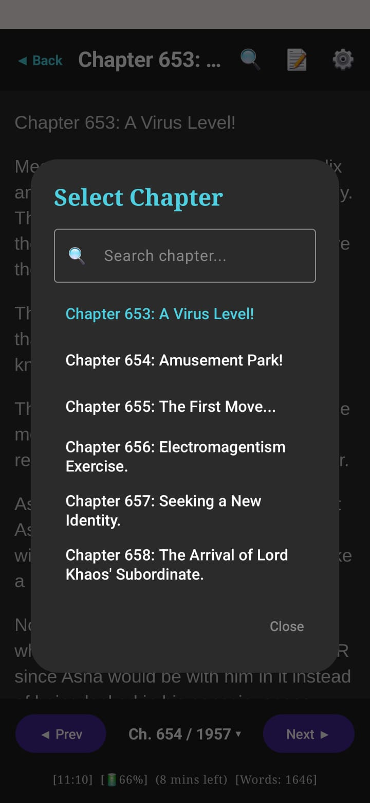
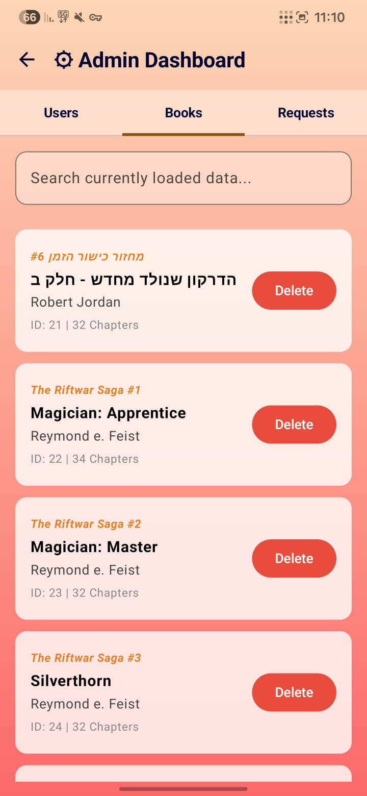
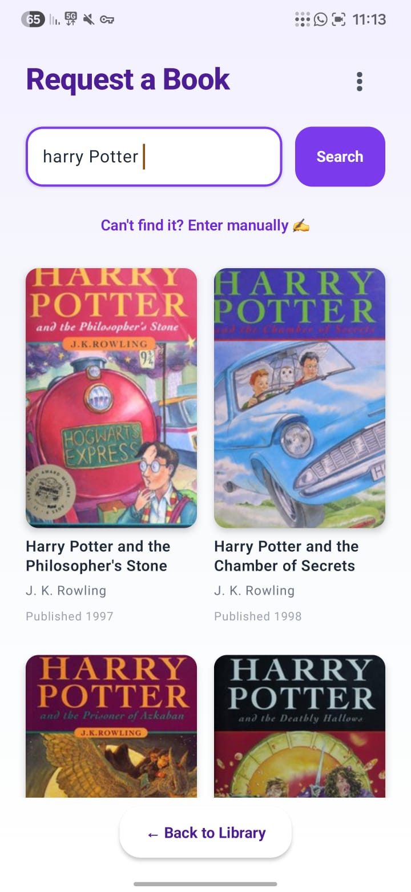

# Poor Men's Kindle


An Android e-book reader application built with Jetpack Compose, designed for a seamless reading experience with both online library sync and offline EPUB support.

## 🌟 Features

- **Online Library**: Browse and read books from a remote server.
- **Offline Reading**: Support for reading local EPUB files.
- **Advanced Reader**: Customizable reading experience with scroll progress tracking.
- **Highlights**: Save and manage highlights from your books.
- **Admin Dashboard**: Manage users, books, and book requests.
- **Book Requests**: Users can request new books directly through the app.
- **Synchronization**: Offline sync manager for reading progress and library data.
- **Clean Codebase**: Organized structure with a focus on readability and modularity.

## 📱 Screenshots

<p align="center">
  
  
  
</p>

<p align="center">
  
  
  
</p>

<p align="center">
  
</p>

<p align="center">
  <video src="https://github.com/user-attachments/assets/79b95f59-61bc-4ec2-88f1-381d45b4ff2b" width="45%" controls></video>
</p>

## 🛠 Tech Stack

- **Language**: [Kotlin](https://kotlinlang.org/) (JVM 11)
- **UI Framework**: [Jetpack Compose](https://developer.android.com/compose)
- **Networking**: [Retrofit](https://square.github.io/retrofit/) & [OkHttp](https://square.github.io/okhttp/)
- **Database**: [Room Persistence Library](https://developer.android.com/training/data-storage/room)
- **Image Loading**: [Coil](https://coil-kt.github.io/coil/)
- **EPUB Parsing**: [epublib](https://github.com/psiegman/epublib)
- **HTML Parsing**: [JSoup](https://jsoup.org/)
- **Architecture**: MVVM
- **Target SDK**: Android API 36 (Minimum API 26)

## 🚀 Getting Started

### Requirements

- Android Studio (latest version recommended)
- JDK 11
- Android SDK 26+

### Setup & Run

1. **Clone the repository**:
   ```bash
   git clone <repository-url>
   cd PoorMensKindle
   ```

2. **Open in Android Studio**:
   Open the project folder in Android Studio.

3. **Configure Environment**:
   - The API base URL is defined in `com.poorMenKindle.android.network.NetworkManager`.
   - Update `BASE_URL` to point to your backend server.

4. **Build and Run**:
   - Connect an Android device or start an emulator.
   - Click the **Run** button in Android Studio or use Gradle:
     ```bash
     ./gradlew assembleDebug
     ```
Note: This application requires the BookWormHole backend to function fully. Ensure your server is running before logging in.

## 📖 API Documentation

The project communicates with a backend server named **BookWormHole**. You can find the full REST API specification in the [API_SPECIFICATION.md](API_SPECIFICATION.md) file.

## 📜 Scripts

- `./gradlew assembleDebug`: Build the debug APK.
- `./gradlew test`: Run unit tests.
- `./gradlew connectedAndroidTest`: Run instrumentation tests on a device.
- `./gradlew lint`: Run lint checks.

## 📁 Project Structure

```text
app/
├── src/
│   ├── main/
│   │   ├── java/com/poorMenKindle/android/
│   │   │   ├── data/local/      # Room database, DAOs, and OfflineSyncManager
│   │   │   ├── network/         # Retrofit API services and models
│   │   │   ├── ui/
│   │   │   │   ├── navigation/  # Jetpack Compose Navigation
│   │   │   │   ├── screens/     # UI screens (Login, Library, Reader, Admin, etc.)
│   │   │   │   └── theme/       # Compose theme and styling
│   │   ├── assets/fonts/        # Custom fonts for the reader
│   │   └── res/                 # Android resources (strings, drawables, etc.)
│   └── test/                    # Unit tests
└── build.gradle.kts             # App-level build configuration
```

## 🔑 Environment Variables & Config

- `NetworkManager.BASE_URL`: The endpoint for the backend service.
- `SharedPreferences ("BookWormHolePrefs")`: Stores JWT tokens and user roles.

## 🧪 Tests

- **Unit Tests**: Located in `app/src/test`. Run with `./gradlew test`.
- **Instrumentation Tests**: Located in `app/src/androidTest`. Run with `./gradlew connectedAndroidTest`.

## 📄 License

Distributed under the MIT License. See `LICENSE` for more information.

---

*Note: This project is actively developed. See the codebase for the latest changes and features.*

## 🤝 Contributing
Contributions, issues, and feature requests are welcome!

## 🙋‍♂️ Author
**יגל גרוס (Yagel Gross)**
* GitHub: [@yagelgross](https://github.com/yagelgross)